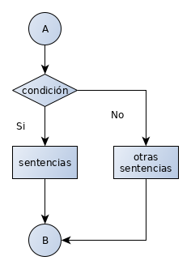
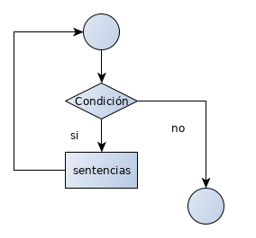
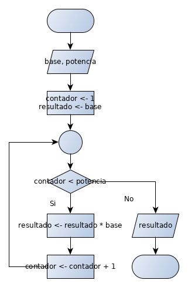

# Fundamentos de Algoritmos

- [Fundamentos de Algoritmos](#fundamentos-de-algoritmos)
  - [Definición de Algoritmo](#definici%c3%b3n-de-algoritmo)
  - [Estructura de un algoritmo](#estructura-de-un-algoritmo)
  - [Econtrar el mayor de tres números cualesquiera](#econtrar-el-mayor-de-tres-n%c3%bameros-cualesquiera)
  - [Pseudocódigo: Mayor de tres números](#pseudoc%c3%b3digo-mayor-de-tres-n%c3%bameros)
  - [Diagramas de Flujo: Estándar ANSI](#diagramas-de-flujo-est%c3%a1ndar-ansi)
  - [Diagrama de Flujo: Mayor de 3 números](#diagrama-de-flujo-mayor-de-3-n%c3%bameros)
  - [Estructuras Básicas de Programación](#estructuras-b%c3%a1sicas-de-programaci%c3%b3n)
  - [Estructura secuencial](#estructura-secuencial)
  - [Estructuras Selectivas](#estructuras-selectivas)
  - [Estructura Iterativa](#estructura-iterativa)
  - [Tareas](#tareas)


## Definición de Algoritmo
- Un algoritmo es una secuencia lógica de pasos para resolver un 
problema o llevar a cabo un proceso
  - Un algoritmo familiar es la receta de cocina
  - En el entorno de empresa, se habla de procedimientos
- Los algoritmos deben ser aplicables a un variedad de casos
- El detalle del algoritmo se especifica dependiendo del receptor del algoritmo
  - Dependiendo del receptor se pueden especificar operaciones de alto nivel o no

## Estructura de un algoritmo
- En un algoritmo se pueden identificar: 
  - Entradas
  - Proceso 
  - Salidas
En una receta, los ingredientes son la entrada, el proceso es la indicación de como mezclarlos y cocinarlos y la salida es el resultado de la receta


## Econtrar el mayor de tres números cualesquiera
1. Obtener el primer y segundo números
2. Comparar el primer y segundo númreos
   1. Si el primero es mayor que el segundo, anotarlo como mayor
   2. Si el segundo es mayor que el primero, anotarlo como mayor
   3. Si son iguales, registrarlo como mayor
3. Obtener el tercer número
4. Comparar el tercer número con el mayor
   1. Si el tercer número es mayor que el actual, registrarlo como mayor
5. Mostrar el número mayor

## Pseudocódigo: Mayor de tres números
```
LEER n1  
LEER n2  
SI ( n1 > n2 )  
ENTONCES  
   m <- n1  
FIN DE SI  
SI ( n2 > n1 )  
ENTONCES  
   m <- n2  
FIN DE SI  
SI( n1 = n2 )  
ENTONCES  
  m <- n1  
FIN DE SI  
LEER n3
SI ( n3 > m )
ENTONCES
  m <- n3
FIN DE SI
DESPLEGAR m
```
## Diagramas de Flujo: Estándar ANSI
La siguiente imagen fue tomada de la Wikipedia (https://en.wikipedia.org/wiki/Flowchart#Common_symbols)


## Diagrama de Flujo: Mayor de 3 números


## Estructuras Básicas de Programación
Bohm y Jacopini llegaron a la conclusión de que cualquier algoritmo se puede describir con una combinación de tres estructuras básicas
- Secuencial
- Selectiva o de decisión
- Iterativa o repetitiva

## Estructura secuencial
Las sentencias o instrucciones se ejecutan una después de otra o "en secuencia"

Pseudocódigo
```
LEER n
cuadrado <- n*n
DESPLEGAR cuadrado
```

Diagrama de Flujo  


## Estructuras Selectivas
Con base en una condición, el flujo de operación del algoritmo puede alterarse, por lo que ya te tenemos una secuencia.  
La estructura selectiva más común es el IF (SI)

```
SI (condición)
ENTONCES
  sentencias
SI NO
  otras sentencias
FIN DE SI
```


Ejemplo: Determinar si un númreo es múltiplo de otro
```
LEER n1, n2
SI( n1%n2 = 0)
ENTONCES
  DESPLEGAR n1 es múltiplo de n2
SI NO
  DESPLEGAR n1 no es múltiplo de n2
FIN DE SI
```


## Estructura Iterativa
Un conjunto de sentencias o instrucciones se repite un número de veces con base en una condición
```
MIENTRAS(condición)
   sentencias
FIN DE SI
```



Ejemplo: Elevar un número a una potencia entera mayor a cero  
Pseudocódigo
```
LEER base, potencia
contador <- 1
resultado <- base
MIENTRAS(contador < potencia)
  resultado <- resultado * base
  contador <- contador + 1
FIN DE MIENTRAS
DESPLEGAR resultado
```
Diagrama de flujo:  


## Tareas
Presentar en diagrama de flujo en yEd y en seudocódigo los siguietnes programas
 1. Escriba un algoritmo que calcule, dada una temperatura en grados centígrados, su equivalente en grados Fahrenheit y viceversa. 
      - Nota: Para convertir de centígrados a Fahrenheit se utiliza la fórmula 9/5x+32, donde x es son los grados centígrados. Para convertir de farenheit a centígrados, se puede usar 5-9(x-32)
      - Nota 2: Este algoritmo solo utiliza estructura secuencial
 2. Escriba un algoritmo que dados el número de kilómetros recorridos y la cantidad de litros utilizada para recorrerlos, calcule el rendimiento en kilómetros por litro de un vehículo
      - Nota: Este algoritmo solo requiere estructura secuencial
 3. Escriba un algoritmo, que dados 5 números enteros, determine cuantos de estos números son negativos, cuantos positivos y cuantos cero.  
        - Nota: Escriba una versión de este algoritmo usando solamente estructuras secuenciales y de selección o decisión, no utilice estructuras de repetición.
        - Nota 2: Escriba otra versión de este algoritmo usando estructuras secuenciales, de selección y repetición
 4. Escriba un algoritmo, que dado un conjunto de n números enteros, determine cuantos son pares y cuantos impares
 5. Escriba un algoritmo, que dado un número n calcule su factorial. El factorial de un número n positivo, n! se define como
  - n! = n * (n-1)!
  - 1! = 1 